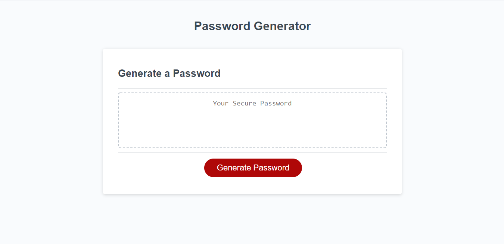

# Horiseon - Refactoring

## Description

The purpose of this activity was to enable the button to generate a password for the user according to user's preferences .

## Website

## Code

The code already included all of the HTML and CSS needed for the webpage, so only the Javascript part was added.

## Credits

This code was worked upon by Xander Rapstine and Luiz Padredi.\n
It was originally written by Xander Rapstine, and Luiz Padredi added the JS logic for the button.
