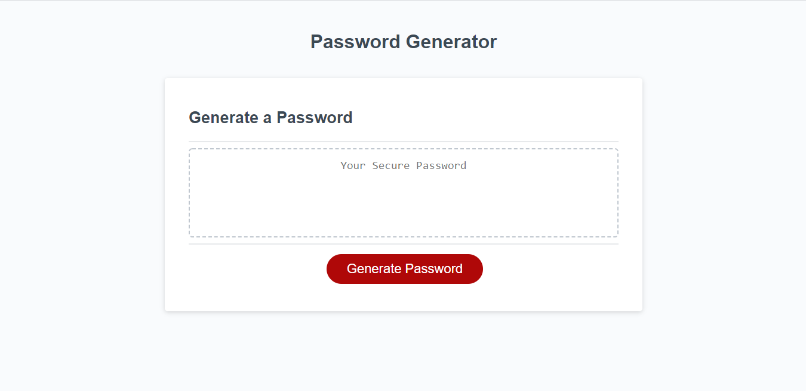

# Luiz Guilherme Padredi

# Password Generator - Adding Javascript Logic :pencil:

## :label: Description
This program generates a password according to the user's preferences .

## :scroll: Instructions
To generate a password, click the 'Generate Password' button and set your preferences through the pop-ups by clicking OK for yes, and CANCEL for no.

## 	:hash: Coding Languages Used
:heavy_check_mark: HTML 
:heavy_check_mark: CSS 
:heavy_check_mark: JavaScript  
jQuery and Bootstrap were not used.

## :desktop_computer: Website
Link to Website: https://padredilg.github.io/password-generator/
  
Screenshot from Website:

## :clap: Credits

:hammer_and_wrench: Created by Luiz Guilherme Padredi
